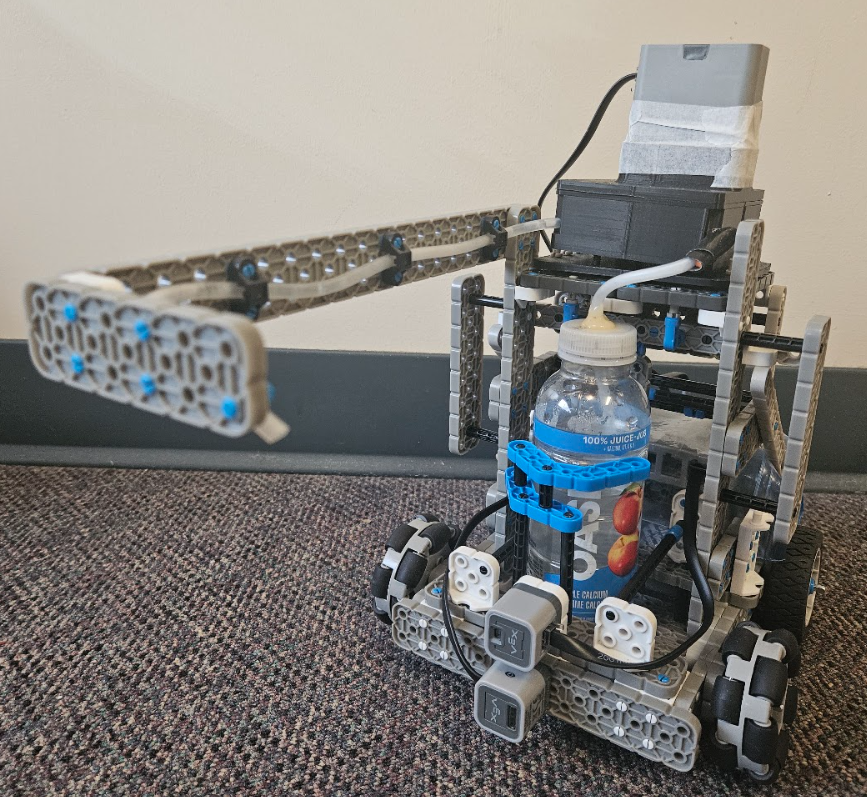
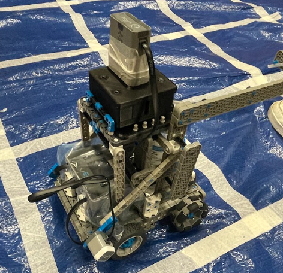

# Aquatron Irrigation Robot

**Platform:** VEX IQ 2nd Generation (IQ2)
**Language:** C++
**Course:** MTE 100 and MTE 121, Mechatronics Engineering, University of Waterloo
**Team:** Gurkamal Saini, Harsh Patel, Elil Thirumugam, Ben Waddell (Group 14)
**Date:** December 2, 2025

---

## Table of Contents

1. [Project Overview](#project-overview)
2. [How It Works](#how-it-works)
3. [Hardware Requirements](#hardware-requirements)
4. [Mechanical Design](#mechanical-design)
5. [Repository Structure](#repository-structure)
6. [Software Architecture](#software-architecture)
7. [Class Reference: Drivetrain](#class-reference-drivetrain)
8. [Class Reference: Pump](#class-reference-pump)
9. [Main Program Flow](#main-program-flow)
10. [Color Detection and Watering Times](#color-detection-and-watering-times)
11. [PID Control](#pid-control)
12. [Direction Encoding](#direction-encoding)
13. [Motor Port Configuration](#motor-port-configuration)
14. [Build Instructions](#build-instructions)
15. [Operating Instructions](#operating-instructions)
16. [Constraints and Limitations](#constraints-and-limitations)
17. [Test Results](#test-results)
18. [Known Issues](#known-issues)
19. [Recommendations for Future Work](#recommendations-for-future-work)
20. [Acknowledgements](#acknowledgements)

---

## Project Overview



Aquatron is a fully autonomous irrigation robot that maps a 3x3 grid of plants, identifies each plant by the color of its pot, and waters each plant for a predetermined amount of time based on that color. It was designed and built for the Group Design Project in Term 1A of Mechatronics Engineering at the University of Waterloo.

The robot targets a real problem: inconsistent or forgotten plant watering when owners are traveling, physically unable to water plants, or simply unavailable. Aquatron eliminates the need for a human waterer by running a complete mapping and watering cycle on its own from start to finish.

### What the Robot Does

1. Waits for a user to press and release the TouchLED sensor to begin.
2. Runs a Depth-First Search (DFS) algorithm to physically explore all nine cells of a 3x3 grid on a tarp.
3. During exploration, detects whether each adjacent cell contains a plant or obstacle using the distance sensor and reads the pot color using the optical color sensor.
4. Stores the grid layout in a 2D integer array after exploration is complete.
5. Returns to the origin cell after the DFS phase ends.
6. Iterates through plants in a fixed color priority order: yellow, green, purple, and orange/red.
7. For each color, computes a route from the origin to the plant using a second internal DFS-based mapping algorithm that avoids dead ends.
8. Drives to the plant, activates the peristaltic pump for the time corresponding to the plant color, then returns to the origin.
9. After watering all plants, displays a confirmation message and shuts the program down.

---

## How It Works

### Phase 1: Exploration (Physical DFS)

The robot starts at grid position [0][0], which is the top-left corner of the 3x3 grid. It faces upward, away from the grid. The DFS algorithm physically rotates the robot in four directions (right, left, up, down) to check adjacent cells one at a time.

For each direction, if the adjacent cell is within bounds and has not been visited:

- The robot turns to face that direction using PID-controlled rotation.
- The distance sensor checks whether an object is within 200mm of the front of the robot.
- If an object is detected, the robot drives forward to within 20mm of the object using PID-controlled movement, reads the hue value from the optical sensor, classifies the color, stores the color number in the grid array at the coordinates of that cell, marks the cell as visited, and drives back to its starting position in that cell.
- If no object is detected, the cell is empty and is added to a list of possible next moves for exploration.

After scanning all four directions from the current cell, the robot moves to each open adjacent cell one at a time and calls DFS recursively. When it reaches a dead end (all surrounding cells are either out of bounds, visited, or occupied), the recursive call returns and the robot drives back to the previous cell. This backtracking continues until every reachable cell has been visited. The robot then returns to [0][0].

### Phase 2: Path Planning (Internal Mapping DFS)

Once the grid is populated, the program runs a second DFS entirely in software (no physical movement). Given a target cell coordinate from `index_finder`, the `mapping` function searches the known grid for a route from [0][0] to the target, recording each step as a direction code in a movement array. Steps that lead into dead ends are flagged in a parallel `dead` array.

After the mapping function completes, the main program strips out all dead-end flagged steps from the movement array to produce the optimal (not necessarily shortest, but dead-end free) route. It also constructs a reverse path for the return trip by inverting every direction in the going array.

### Phase 3: Watering

The robot follows the computed going array by turning and driving one cell at a time. On the final step it turns to face the plant but does not drive forward, stopping in the adjacent cell from which the pump arm can reach the pot. The pump motor spins in reverse at 100% velocity for the calculated watering duration. After watering, the robot follows the coming array back to the origin and realigns to 0 degrees heading.

---

## Hardware Requirements

### VEX IQ 2 Components

| Component | Purpose | Port |
|---|---|---|
| VEX IQ 2 Brain | Main controller and screen | N/A |
| Left drive motor | Powers the left rear wheel | PORT7 |
| Right drive motor | Powers the right rear wheel | PORT12 |
| Distance sensor | Detects plants and measures proximity | PORT1 |
| Optical (color) sensor | Reads pot hue values under active LED lighting | PORT6 |
| TouchLED sensor | Start trigger pressed by the user | PORT9 |
| Pump motor | Drives the peristaltic pump rotor | PORT10 |
| Inertial sensor (built into Brain) | Measures heading and rotation for PID turning | N/A |

### Additional Physical Materials

| Material | Specification | Purpose |
|---|---|---|
| Silicone rubber tube | 3mm ID, 5mm OD, 1 meter | Peristaltic pump tubing |
| Flanged bearings | 14mm OD, 8mm ID, 4mm thick | Rollers in the pump rotor |
| M4 screws and hex nuts | Standard metric | Fastening pump housing |
| VEX IQ shaft (grey spacer) | Standard | Connecting rotor to motor |
| VEX IQ blue shaft hub (small wheel hub) | Standard | Constraining shaft inside rotor |
| 3D printed pump parts | PLA or equivalent | Bottom housing, outer wall, top housing, rotor disc |
| Water bottle | Oasis or equivalent tall bottle | Water reservoir |
| Hot glue | N/A | Securing tube to bottle cap |
| Electrical tape | N/A | Widening tube exterior to prevent slipping |
| Plastic bag | N/A | Covering the Brain to protect against water |
| Tarp (3x3 grid, ~1m x 1m minimum) | Blue tarp with grid markings | Playing field |

---

## Mechanical Design

### Chassis

The chassis is built entirely from VEX IQ components. Non-powered omni-wheels are mounted at the front of the robot to allow smooth turning without friction. The rear wheels are powered by the two drive motors and provide traction on the tarp surface. All components are packed as tightly as possible to keep the robot within its 25cm x 25cm footprint, which must fit inside a single grid cell.

The VEX IQ Brain is positioned near the back of the robot, clearly separated from the water bottle. It is covered with a plastic bag for water protection. The robot went through two chassis design iterations. The first version was too wide. In the second version, circular grippers replaced the original wall-based bottle restraint, the front bar was brought closer to the Brain to reduce width, and the gap between the walls holding the bottle was tightened for a better fit.

### Pump Mount and Arm

Due to the limited size of the robot, the pump is supported by two weight-bearing vertical posts. Crossbeams were added between the posts to eliminate wobbling. A long horizontal arm extends from the top of the mount so the pump outlet tube reaches over plants without the robot needing to drive into collision range. Bracing supports the arm at an angle that bends the tube downward at the tip, allowing water to flow naturally into the pot. A spine was added along the back of the bottle to prevent it from leaning backward when the motors accelerate.

### Water Bottle

The Oasis water bottle is mounted vertically inside the robot frame, held in place by circular grippers. It is positioned as low and as close to center as possible to minimize the height the pump must lift water.

### Peristaltic Pump

The pump was custom designed and 3D printed. It draws water from the bottle through suction and dispenses it downward through the arm.

#### How the Pump Works

A peristaltic pump works by pressing rollers against a flexible tube wrapped around a circular track. As the rotor spins, each roller compresses the tube at one point, trapping a pocket of liquid. That pocket is pushed along the tube as the roller travels around the housing. When the roller releases, the tube springs back open and a vacuum pulls more fluid in from behind. Running the motor in reverse causes the pump to draw water upward from the bottle.

#### Pump Rotor

The rotor holds four flanged bearings, each 14mm OD and 8mm ID and 4mm thick. A custom 3D printed spacer creates a 2mm gap between the rotor disc and the bearing face. An M4 screw passes through the spacer and through the ID of the bearing, and a hex nut locks it on the outside. The flanges on the bearings prevent the tube from slipping off its track during rotation. The rotor was initially designed with three rollers, but was changed to four because the three-roller version did not achieve the required flow rate given the weak motor. Adding a fourth roller increased the flow rate by 33%.

#### Pump Housing

The pump housing has three parts. The bottom housing holds the rotor assembly and is countersunk to allow the bottom disc of the rotor to sit inside it while still rotating freely. The outer wall curves around the tube path and determines the compression applied to the tube. Finding the correct outer wall radius required five printed iterations. The group ultimately used calipers to measure the fully compressed width of the tube and sized the housing radius accordingly. The top housing mounts the motor and includes several connection points because the VEX IQ connection pins alone did not provide enough hold.

#### Tube Retention Fixes

During testing, the motor would sometimes pull the tube instead of the water, causing the tube to curl up and stall the motor. Two fixes were applied. The tube exterior was wrapped with tape to increase its outer diameter so it could not slide freely through the pump. The tube was also hot glued onto the water bottle cap to prevent it from moving at the inlet.

#### Gear Ratio

Several gear ratios were tested: 1:2, 1:3, 1:1.5, and 1:1.25. Only the 1:1.25 ratio provided enough torque to compress the tube without stalling the motor.

#### Flow Rate

The pump achieves a measured flow rate of 73.75 mL/min. This was verified by timing how long the pump took to fill half a cup (approximately 118 mL), which took 1 minute and 36 seconds. The hand-calculated predicted flow rate based on tube dimensions, roller geometry, motor speed, and occlusion volume was approximately 80 mL/min.

---

## Repository Structure

```
Aquatron-main/
|
|-- include/
|   |-- drivetrain.hpp    # Drivetrain class declaration and method signatures
|   |-- pump.hpp          # Pump class declaration and method signatures
|   |-- vex.h             # Aggregated header including standard libs, IQ2 SDK, and both class headers
|
|-- src/
|   |-- drivetrain.cpp    # Full implementation of the Drivetrain class (16,580 bytes)
|   |-- pump.cpp          # Full implementation of the Pump class (795 bytes)
|   |-- main.cpp          # Entry point: object creation, DFS, mapping loop, watering loop (6,627 bytes)
|
|-- vex/
|   |-- mkenv.mk          # VEXcode toolchain environment settings
|   |-- mkrules.mk        # VEXcode build rules
|
|-- .vscode/
|   |-- c_cpp_properties.json   # IntelliSense configuration
|   |-- extensions.json          # Recommended VSCode extensions
|   |-- settings.json            # Editor settings
|   |-- vex_project_settings.json # Project name, platform, slot, SDK version
|
|-- makefile              # Build target definition, src and header discovery
|-- clean_build.ps1       # PowerShell script for a clean build
|-- .gitignore            # Files excluded from version control
|-- desktop.ini           # Windows folder metadata (not relevant to code)
```

### Project Settings

| Setting | Value |
|---|---|
| Project name | PUMP_ONLY (internal name during development) |
| Target platform | IQ2 (VEX IQ 2nd Generation) |
| Brain program slot | Slot 1 |
| SDK version | IQ2_20250520_15_00_00 |
| Language | C++ |
| VSCode extension version | 0.7.2025041600 |

---

## Software Architecture

The software is organized using Object-Oriented Programming. Two classes encapsulate all robot behavior.

- **Drivetrain** handles all movement, sensing, grid exploration, path planning, and navigation.
- **Pump** handles all watering operations.

This separation keeps each concern isolated and makes the main file easy to read. Header files in `include/` declare the class interfaces. Source files in `src/` contain the implementations. The main program in `src/main.cpp` creates one instance of each class, then calls their methods in sequence to complete the full exploration and watering cycle.

---

## Class Reference: Drivetrain

### Private Members

| Member | Type | Description |
|---|---|---|
| `left_` | `motor` | Left rear drive motor |
| `right_` | `motor` | Right rear drive motor |
| `BrainInertial` | `inertial` | IMU for heading measurement during turns |
| `Brain` | `brain` | Brain object for screen output |
| `DistanceSensor` | `distance` | Distance sensor for plant detection |
| `ColourSensor` | `optical` | Optical sensor for hue reading |
| `TouchSensor` | `touchled` | Touch input for starting the program |
| `timeout` | `timer` | Timer used as a safety cutoff for PID loops |
| `grid_rows` | `int` | Number of rows in the grid (set to 3) |
| `grid_cols` | `int` | Number of columns in the grid (set to 3) |

### Constructor: `Drivetrain(char left_Port, char right_Port, char distanceSensor_port, char colourSensor_port, char touchSensor_port)`

Initializes all motors and sensors from the given port characters. Sets both motors to `brakeType::hold` so the robot stays in place when stopped. Resets motor velocity to 0 and motor position to 0 turns. Turns on the optical sensor LED at 100% brightness. Calibrates the inertial sensor and blocks until calibration is complete (polling every 50ms). Resets rotation and heading to 0 degrees. Prints "Drivetrain Initialized!" to the brain screen for 1 second.

### Destructor: `~Drivetrain()`

Clears the brain screen and prints "Code Complete!" when the object goes out of scope.

### `setGrid(int x, int y)`

Sets `grid_rows` to `x` and `grid_cols` to `y`. Called once in main with values 3 and 3. These values are used as bounds throughout DFS, mapping, and index_finder to prevent array overflows and out-of-bounds traversal.

### `stop()`

Calls `stop()` on both the left and right motors immediately.

### `PIDmove(float distance, float kp = 0.4, float ki = 0.01, float kd = 0.02)`

Moves the robot a target distance in millimeters using a PID feedback loop. The position is measured by averaging the encoder readings of both drive motors, then converting from degrees to millimeters using the wheel circumference ratio (200mm per 360 degrees of rotation). The loop runs for a maximum of 5 seconds. It exits early if the absolute position error drops below 0.1mm. The cumulative error (integral term) accumulates the signed error at each 20ms step. The derivative term tracks the change in error between steps. The computed PID output is applied as a velocity percentage to both motors simultaneously. After the loop exits, both motors are stopped with `hold` brake mode. Negative distance values drive the robot in reverse.

### `PIDturn(float angle, float kp = 0.4, float ki = 0.01, float kd = 0.02)`

Rotates the robot to an absolute heading in degrees using PID feedback from the inertial sensor. Angles greater than 180 degrees are converted to their equivalent negative angle (for example, 270 becomes -90) to ensure the robot always takes the shorter rotation path. The loop runs for a maximum of 5 seconds and exits early when the absolute angle error drops below 1.0 degree. The left motor receives positive speed and the right motor receives negative speed to create a point turn around the robot's center. The cumulative and derivative error terms work the same way as in PIDmove.

### `checkForPlant()`

Reads the distance sensor. Returns `true` if the detected object distance is less than 200mm. Returns `false` otherwise. A 0.2-second wait is included after the read to allow the sensor to settle. This threshold of 200mm is used during DFS to decide whether a cell contains a plant or obstacle versus being empty.

### `moveToPlant()`

Called when `checkForPlant()` returns true. Reads the current distance from the sensor, subtracts 20mm, and drives that distance forward using `PIDmove` so the robot stops 20mm from the object. Reads the hue value from the optical color sensor and classifies it into one of four color integers or an obstacle value. Prints the hue and color value to the brain screen. Then drives backward the same distance to return to the original position. Returns the integer color code.

### `colourtotime(int colourValue)`

Converts a color integer into a watering time in seconds that is passed to `PourWater`. Returns 0 for any unrecognized value.

| Color value | Watering time returned |
|---|---|
| 1 (yellow) | 3 seconds |
| 2 (green) | 6 seconds |
| 3 (purple) | 9 seconds |
| 4 (orange/red) | 11 seconds |

Note: the `PourWater` function multiplies this value by an adjustment factor of 3 internally, so the pump actually runs for 9, 18, 27, or 33 seconds respectively.

### `touchandgo()`

Blocks until the TouchLED sensor is pressed, then blocks again until it is released. Execution of the main program begins only after the user has fully pressed and released the touch sensor.

### `dfs(int grid[][3], int& current_x_pos, int& current_y_pos, bool visit_Array[][3])`

Physically explores the grid using a recursive depth-first search. GitHub Copilot was used to assist in debugging this function.

The direction order scanned at each cell is:

| Index | Delta X | Delta Y | Physical direction | Turn angle |
|---|---|---|---|---|
| 0 | 0 | -1 | Up | 0 degrees |
| 1 | 1 | 0 | Right | 90 degrees |
| 2 | 0 | 1 | Down | 180 degrees |
| 3 | -1 | 0 | Left | 270 degrees |

For each direction, the function checks whether the target cell is in bounds and not yet visited. If the cell passes those checks, the robot turns to face that direction. If `checkForPlant()` returns true, `moveToPlant()` is called and the returned color value is stored in `grid[new_pos_x][new_pos_y]` and the cell is marked visited. If `checkForPlant()` returns false, the cell coordinates are stored in a local `posible_movement` array as a candidate for recursive exploration.

After checking all four directions, the function iterates through the candidate open cells. For each one that is still unvisited, the robot turns to face it, drives 325mm forward, calls `dfs` recursively, then drives 325mm back and turns to face the same direction again to reverse orientation, effectively returning to the current cell.

When all candidates are exhausted (dead end), the recursive call returns to the previous level of the call stack. This backtracking continues until all cells are visited.

### `array_changer(int array1[][3], int array2[][3])`

Transposes the grid array. Computes `array2[i][j] = array1[j][i]` for all i and j. This is required because the mapping function reads rows and columns in the opposite orientation from the DFS function. Calling `array_changer` on the DFS output before passing it to `mapping` corrects the axis ordering.

### `index_finder(int& x_pos, int& y_pos, int grid[][3], int colour_num, bool& check)`

Searches the entire grid array for a cell whose value matches `colour_num`. Sets `x_pos` and `y_pos` to the coordinates of the matching cell. Sets `check` to `true` if a match is found. Initializes `x_pos` and `y_pos` to -1 and `check` to false before searching so that a failed search leaves unambiguous sentinel values. If multiple cells share the same color, the last matching cell found wins (the function does not stop at the first match).

### `mapping(int grid[][3], int& numcnt, bool& finalcheck, int& x_pos, int& y_pos, int& new_x, int& new_y, bool verify[][3], int& verifycnt, int movement[], int dead[], int wanted_x, int wanted_y)`

A recursive internal path-finding function. Unlike `dfs`, this function does not move the robot. It uses the populated grid array to compute a sequence of direction codes from [0][0] to the target cell at (`wanted_x`, `wanted_y`). GitHub Copilot was used for this function.

At each recursive call, the function checks all four adjacent cells from the current position. The direction offsets checked are:

| Index | Delta X | Delta Y | Direction code recorded |
|---|---|---|---|
| 0 | 0 | +1 | 1 (right) |
| 1 | +1 | 0 | 3 (down) |
| 2 | 0 | -1 | 2 (left) |
| 3 | -1 | 0 | 4 (up) |

Cells that are out of bounds, already in the `verify` array, or non-zero (occupied by a plant or obstacle) are skipped. If the target cell is found, `finalcheck` is set to false, the final direction code is stored in `movement[numcnt]`, and the recursion unwinds. If the target is not found in the immediate neighbors, each reachable empty cell is explored recursively. A cell that leads to a dead end has its corresponding `movement` index flagged in the `dead` array by setting `dead[numcnt - 1] = 1` after the recursive call returns without finding the target.

### `GoToPos(int path[], int finalcnt)`

Drives the robot to the target plant by following the direction codes in the `going` array. For each step except the last, the robot turns to the heading corresponding to the direction code and then drives 340mm forward. On the last step, the robot turns to face the target direction but does not drive forward. This leaves the robot in the cell adjacent to the plant with the pump arm pointing toward the pot.

| Direction code | Turn heading |
|---|---|
| 1 (right) | 90 degrees |
| 2 (left) | 270 degrees |
| 3 (down) | 180 degrees |
| 4 (up) | 0 degrees |

### `comeHome(int path[], int finalcnt)`

Returns the robot to the origin by following the reverse direction codes in the `coming` array. Starts from index 1 (skipping index 0 because the last step of `GoToPos` did not move forward, so no backward step is needed to undo it). For every step, turns to the heading of the reversed direction and drives 340mm forward. After the loop completes, turns to 0 degrees to realign the robot heading to its default upward-facing orientation.

### `WateringPosition(float& distance_initial)`

Reads the current distance from the sensor, subtracts 30mm (leaving a slightly larger gap than `moveToPlant`), and drives forward that distance. This function is declared in the header but is not called in the final `main.cpp`. Watering is performed while the robot is stationary in the adjacent cell.

### `displayHue()`

Declared in the header but not implemented in the submitted code. Intended as a debugging utility for reading raw hue values from the optical sensor.

---

## Class Reference: Pump

### Private Members

| Member | Type | Description |
|---|---|---|
| `Brain` | `brain` | Brain object for screen messages |
| `PumpMotor` | `motor` | Motor driving the peristaltic pump rotor |
| `timeout` | `timer` | Measures watering duration |

### Constructor: `Pump(char PumpMotor_port)`

Initializes the pump motor on the given port without reversing direction (second argument `false`). Sets stopping mode to `hold`. Sets velocity to 0. Prints "Pump Initialized!" to the screen for 1 second.

### Destructor: `~Pump()`

Empty destructor.

### `stop()`

Stops the pump motor immediately.

### `PourWater(int seconds)`

Runs the pump motor in reverse at 100% velocity for `seconds * 3` seconds (the constant `adjustment = 3` accounts for the difference between the color-to-time lookup values and actual required pump run times). Uses a busy-wait loop polling the timer rather than a `wait` call. After the timer expires, calls `stop()`, prints "Watered!" to the screen, waits 1 second, and clears the screen.

The pump motor is spun in `reverse` because the rotor geometry of this particular pump design draws water upward when spinning in the reverse direction relative to the motor's default forward convention.

---

## Main Program Flow

```
1. Create brain, Drivetrain (ports 7, 12, 1, 6, 9), and Pump (port 10)
2. setGrid(3, 3)
3. Declare all state arrays: old_grid, grid, visit_Array, verify,
   movement, dead, going, coming (all 3x3 or size-50 as needed)
4. touchandgo()                                 (wait for user to press and release TouchLED)
5. dfs(old_grid, 0, 0, visit_Array)             (physically map the grid)
6. array_changer(old_grid, grid)                (transpose for mapping function)
7. Wait 2 seconds

8. For color_to_find = 1 to 4:
   a. Reset all counters, arrays, and flags
   b. index_finder(wanted_x, wanted_y, grid, color_to_find, check)
   c. If found (check == true and coordinates in bounds):
      i.   mapping(...)                         (compute movement and dead arrays)
      ii.  Count movement steps (secondcnt)
      iii. Count dead-end steps (deadcnt)
      iv.  Build going[] by keeping only non-dead steps (finalcnt = secondcnt - deadcnt)
      v.   Build coming[] by reversing directions of going[]
      vi.  Display path steps on screen
      vii. GoToPos(going, finalcnt)
      viii. colourtotime(grid[wanted_x][wanted_y]) returns water_time
      ix.  PourWater(water_time)
      x.   comeHome(coming, finalcnt)
      xi.  PIDturn(0)                           (realign to default heading)
   d. If not found:
      Print "Color X not Found!"

9. Print "All plants watered!"
10. Brain.programStop()
```

---

## Color Detection and Watering Times

The optical sensor LED is set to maximum brightness (100%) during initialization to ensure consistent hue readings regardless of ambient light conditions.

| Color | Hue range | Grid value stored | `colourtotime` output | Actual pump run time |
|---|---|---|---|---|
| Yellow | 35 to 59 | 1 | 3 seconds | 9 seconds |
| Green | 85 to 120 | 2 | 6 seconds | 18 seconds |
| Purple | 279 to 303 | 3 | 9 seconds | 27 seconds |
| Orange / Red | 340 to 360 or 0 to 24 | 4 | 11 seconds | 33 seconds |
| Unknown / Obstacle | Any hue not in the above ranges | 8 | 0 seconds | Not watered |

Orange and red are combined into a single range because the VEX IQ color sensor sometimes reads orange as red and vice versa. Using a hue-based approach instead of the built-in color name function avoids these misclassifications. Purple was also sometimes reported as blue by the sensor name function, which is another reason hue ranges are used throughout.

Plants are watered in the fixed sequence 1, 2, 3, 4 (yellow, green, purple, orange/red). If a color is not present in the grid, the robot skips it and prints a not-found message.

Each plant in the grid must have a unique color. The algorithm has no mechanism to distinguish between two plants of the same color and would only be able to locate one of them.

---

## PID Control

Both PID functions share the same default gains. These were tuned empirically for the VEX IQ 2 hardware on a tarp surface.

| Gain | Default value | Role |
|---|---|---|
| kp (proportional) | 0.4 | Primary correction, scales directly with remaining error |
| ki (integral) | 0.01 | Accumulates small persistent errors to eliminate steady-state offset |
| kd (derivative) | 0.02 | Damps oscillation by reacting to the rate of change of error |

| Parameter | PIDmove | PIDturn |
|---|---|---|
| Maximum loop duration | 5 seconds | 5 seconds |
| Exit tolerance | 0.1mm | 1.0 degree |
| Update interval | 20ms | 20ms |
| Error measure | Average motor encoder degrees converted to mm | IMU rotation in degrees |
| Motor direction for correction | Both forward (same sign) | Left forward, right reverse (opposing signs) |

The proportional term alone would cause overshoot because the VEX IQ motors have no built-in brake to stop instantly. The integral term corrects for undershoot that the proportional term alone cannot resolve. The derivative term prevents the robot from oscillating back and forth around the target.

---

## Direction Encoding

Two different encoding schemes are used in different parts of the code. Be careful not to mix them up.

### DFS turn angles (used in the physical DFS exploration)

| Direction index | Heading (PIDturn argument) | Grid movement |
|---|---|---|
| 0 | 0 degrees (up) | y - 1 |
| 1 | 90 degrees (right) | x + 1 |
| 2 | 180 degrees (down) | y + 1 |
| 3 | 270 degrees (left) | x - 1 |

### Movement array codes (used in mapping, GoToPos, and comeHome)

| Code | Meaning | Turn heading |
|---|---|---|
| 1 | Right | 90 degrees |
| 2 | Left | 270 degrees |
| 3 | Down | 180 degrees |
| 4 | Up | 0 degrees |

The return path inverts each code: 1 becomes 2, 2 becomes 1, 3 becomes 4, and 4 becomes 3.

---

## Motor Port Configuration

These ports are hardcoded in `src/main.cpp`. If the physical wiring changes, update the port numbers in the `Drivetrain` and `Pump` constructor calls.

```cpp
Drivetrain drive(PORT7, PORT12, PORT1, PORT6, PORT9);
//               left   right   dist   color  touch
Pump PumpMotor(PORT10);
```

| Port | Device |
|---|---|
| PORT1 | Distance sensor |
| PORT6 | Optical color sensor |
| PORT7 | Left drive motor |
| PORT9 | TouchLED sensor |
| PORT10 | Pump motor |
| PORT12 | Right drive motor |

The right motor is initialized with the reverse flag set to `true` inside the Drivetrain constructor member initialization list (`right_(right_Port, true)`). This corrects for the physical orientation of the motor being mounted in the opposite direction from the left motor so that both motors spin the robot forward when given a positive velocity.

---

## Build Instructions

### Requirements

- VSCode with the VEXcode IQ 2 extension (version 0.7 or later)
- VEX IQ 2 C++ SDK (IQ2_20250520_15_00_00 or compatible)
- GNU Make (included with the VEXcode toolchain)
- A VEX IQ 2 Brain connected via USB

### Steps

1. Open the `Aquatron-main` folder in VSCode.
2. The VEXcode extension will detect the project from `.vscode/vex_project_settings.json` automatically.
3. Click the Build button in the VEXcode toolbar, or run `make` in the terminal from the project root.
4. The compiled `.bin` file will appear in the build output directory.
5. Connect the VEX IQ 2 Brain via USB.
6. Use the VEXcode extension's download button to flash the binary to Slot 1 on the Brain.

To do a clean build (remove all compiled artifacts before rebuilding):

```powershell
.\clean_build.ps1
```

---

## Operating Instructions

### Physical Setup

1. Place the tarp flat on the floor. Mark a 3x3 grid with tape or use pre-existing grid markings. Each cell should be approximately 340mm wide to match the robot's movement step size.
2. Place plant pots in any arrangement within the grid. Each pot must have a solid-colored exterior in one of the four supported hue ranges. Every pot must be a different color.
3. Ensure no pot is placed in cell [0][0] (the top-left corner, which is the robot's starting position).
4. Ensure the arrangement of pots does not fully block any cell from being reachable by the DFS (the robot cannot teleport over obstacles, so make sure there is always at least one open path from each side of the grid).
5. Fill the water bottle to the desired level and secure it in the robot chassis cradle.
6. Position the robot in cell [0][0] facing upward (away from the grid).
7. Verify all sensor and motor cables are connected to the correct ports.
8. Power on the VEX IQ 2 Brain.

### Starting the Program

1. On the Brain, navigate to the program in Slot 1 and run it.
2. The Brain screen will display "Drivetrain Initialized!" for 1 second, then "Pump Initialized!" for 1 second.
3. The inertial sensor calibrates automatically during initialization. Do not move the robot during this phase.
4. Press and hold the TouchLED sensor. Release it when ready. The robot will begin exploration immediately upon release.

### During Operation

Do not move any pots or the robot while it is running. The robot's DFS algorithm assumes the grid is static after exploration begins. Moving an object mid-run will cause incorrect watering or navigation failures.

The brain screen displays the current action at each step, including which direction is being checked, whether a plant was found, the hue reading, the detected color, and the planned path steps. This information can be used for debugging if the robot does not behave as expected.

---

## Constraints and Limitations

| Constraint | Value or description |
|---|---|
| Robot footprint | 25cm x 25cm |
| Grid size | Fixed 3x3, hardcoded |
| Cell spacing | 340mm center to center (navigation), 325mm used during DFS traversal |
| Maximum objects in grid | 8 (one cell is always the robot start) |
| Supported plant colors | Yellow, green, purple, orange/red |
| Unique colors required | Yes, each plant must have a different color |
| Maximum pump flow rate | 73.75 mL/min |
| Battery life | One full cycle before recharging is required |
| DFS cell detection range | 200mm threshold for obstacle detection |
| Motor torque | Very limited; pump gear ratio cannot exceed 1:1.25 without stalling |
| Color sensor accuracy | Hue is used instead of color name to avoid misclassification of similar colors |
| Inertial sensor | Must be kept still during calibration at startup |
| Water leakage | Minimal leakage was observed; tube sealing quality affects this |

---

## Test Results

### Qualitative

- The robot successfully reached plants in multiple tested arrangements without collision.
- Water was dispensed into the pot on every successful watering attempt.
- Plant colors were correctly sensed and stored in the grid array during all tests.
- PID control kept the robot within its designated cell throughout exploration and navigation.
- The chassis maintained structural stability throughout the full run cycle.

### Quantitative

| Metric | Result |
|---|---|
| Measured pump flow rate | 73.75 mL/min |
| Predicted pump flow rate | ~80 mL/min |
| Fill time for 118mL (half cup) | 1 minute 36 seconds |
| Flow rate improvement from 3-roller to 4-roller | 33% increase |
| Grid size | 3x3 (9 cells) |
| Pump housing iterations | 5 revisions of outer wall |
| Chassis versions | 2 |
| Tested gear ratios | 1:2, 1:3, 1:1.5, 1:1.25 (only 1:1.25 had sufficient torque) |

---

## Known Issues

- The program has a typo in the `GoToPos` function in Appendix C of the report (a stray `s` follows a closing brace). The actual `drivetrain.cpp` source file in the repository does not have this typo and compiles cleanly.
- The `WateringPosition` and `displayHue` functions are declared in `drivetrain.hpp` but are not called anywhere in the main program. They were used during development and debugging.
- The `index_finder` function in the report's appendix contains a logic error where it checks `if (x_pos == 0 && y_pos == 0)` to decide whether a color was found. The actual source file in the repository fixes this by initializing `x_pos` and `y_pos` to -1 and `check` to false before the search loop.
- The PIDmove function in the report's appendix has an incorrect while condition (`timeout.time(sec) > 3.5` instead of `< MAX_TIME`). The source file in the repository uses the correct condition with `< MAX_TIME` (5 seconds).
- The robot requires manual battery charging between full run cycles because the VEX IQ brain battery does not last more than one complete exploration and watering session.
- If two plants of the same color are placed in the grid, `index_finder` will only store the coordinates of the last one found in the scan order, and the first one will never be watered.

---

## Recommendations for Future Work

- **Platform upgrade:** Switching to VEX V5 or off-the-shelf motors and controllers would provide significantly higher motor torque, better battery life, and more powerful sensors. This would remove most of the current constraints around pump design and movement precision.
- **Automatic charging:** Implementing a charging dock similar to those used in modern robot vacuums would allow the robot to complete multiple watering cycles per day without human intervention.
- **Automatic water refilling:** A water inlet or a larger onboard reservoir would reduce how frequently the bottle needs to be manually refilled.
- **Custom water tank:** Replacing the standard water bottle with a custom-shaped tank would improve weight distribution, reduce spillage risk, and allow a larger volume without affecting the center of mass.
- **Robotic arm:** Adding an articulating arm would allow the robot to water pots of different heights and sizes without needing to position the entire chassis near each plant.
- **Camera and computer vision:** A camera on the arm combined with a plant identification model could detect plant type and health automatically, removing the need for colored pots entirely.
- **Dynamic grid sizing:** The grid dimensions are currently hardcoded as 3x3. Parameterizing this would let the same codebase handle larger growing areas.
- **Persistent plant registry:** A storage system mapping plant coordinates to plant species and watering schedules would let the robot manage a wider variety of plants with different needs.

---

## Acknowledgements

Teaching staff in MTE 100 and MTE 121 at the University of Waterloo.

Forrest and Griffin, the group's evaluators, assisted with conceptualizing and working through design problems.

GitHub Copilot was used to debug the DFS function (`drivetrain.cpp::dfs`) and to assist in writing the mapping function (`drivetrain.cpp::mapping`). All other functions in the codebase were written independently by the team.

Great Scott's YouTube video on 3D printed peristaltic pumps helped the team understand how peristaltic pumps work and how to implement one effectively.

---

## References

1. Statistics Canada. "Herb your enthusiasm." 2024. https://www.statcan.gc.ca/o1/en/plus/5993-herb-your-enthusiasm
2. Teaching Team, University of Waterloo. "Project Description." Mechatronics Engineering Department, 2022.
3. PattysLab. "3D Printed Peristaltic Pump Fully Parametric W/Fusion 360 And Nema Stepper." YouTube, June 12, 2022. https://www.youtube.com/watch?v=2UYmvd_jUCE
4. C. Palmer and R. Govier. "A study of the peristaltic life and pumping performance of three TPE tubing products." Fluid Technology Solutions. https://www.wmfts.com/globalassets/literature/wp-pureweld-xl-continuous-bioprocessing.pdf
5. C. de Looper. "Robotic Vacuum Replenishes Its Water Tank Using Air Moisture." Design Milk, June 6, 2025. https://design-milk.com/this-robotic-vacuum-replenishes-its-water-tank-using-air-moisture/
